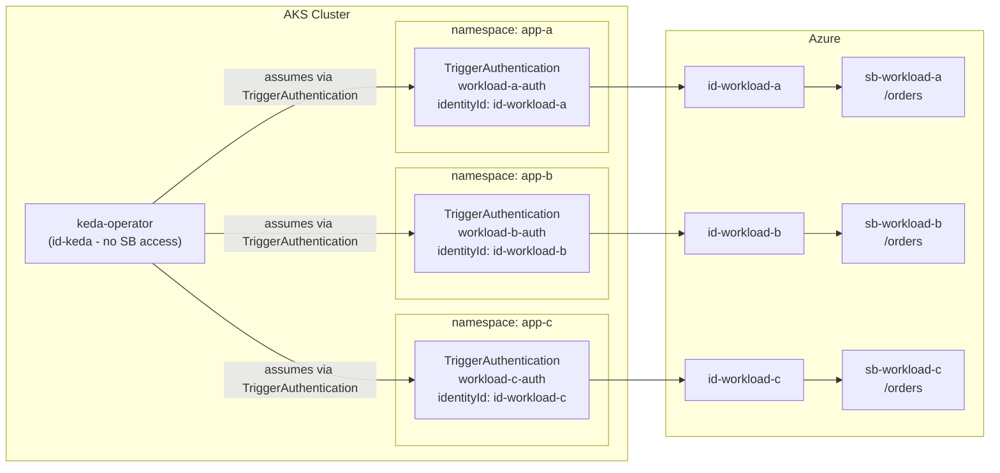

# AKS KEDA Demo - Per-Workload Identity Scoping with TriggerAuthentication

[KEDA](https://keda.sh) on AKS using Azure AD Workload Identity,
following the Case 2 identity pattern so the KEDA operator never needs direct Service Bus access.

>[!NOTE]
> This is an updated demo taken from the [kedacore samples](https://github.com/kedacore/sample-dotnet-worker-servicebus-queue/blob/main/workload-identity.md).

## Overview

Three workloads (A, B, C) each pull from their own Azure Service Bus queue.
KEDA scales each deployment based on queue depth.
Rather than granting the KEDA operator broad Service Bus permissions,
each workload has its own managed identity scoped to its own queue.
A `TriggerAuthentication` per workload tells KEDA which identity to use when checking that queue.

## Architecture



## Identity Design (KEDA Case 2)

The KEDA Azure AD Workload Identity docs describe two ways to handle multi-workload identity:

**Case 1** - KEDA's own identity is granted access to every Service Bus it needs to monitor.
Each workload may still have its own identity for runtime use,
but KEDA uses its single identity for all scaling decisions.
Simple to set up,
but the KEDA identity accumulates permissions as workloads are added.

**Case 2** - KEDA's identity has no Service Bus access at all.
Each workload has its own identity scoped to its own queue,
and a `TriggerAuthentication` tells KEDA to assume that identity when evaluating that specific trigger.
The KEDA operator service account must be federated with every identity it may assume.
More setup upfront,
but the operator's permissions never grow and each workload is fully isolated.

This repo uses Case 2.
Four user-assigned managed identities are provisioned:

| Identity        | Service Bus access   | Purpose                      |
| --------------- | -------------------- | ---------------------------- |
| `id-keda`       | None                 | KEDA operator's own identity |
| `id-workload-a` | `sb-workload-a` only | Scoped to Workload A's queue |
| `id-workload-b` | `sb-workload-b` only | Scoped to Workload B's queue |
| `id-workload-c` | `sb-workload-c` only | Scoped to Workload C's queue |

### How the override works

Each workload namespace has a `TriggerAuthentication`
that sets `spec.podIdentity.identityId` to that workload's managed identity client ID:

```yaml
apiVersion: keda.sh/v1alpha1
kind: TriggerAuthentication
metadata:
  name: workload-a-auth
  namespace: app-a
spec:
  podIdentity:
    provider: azure-workload
    identityId: "<id-workload-a client ID>" # overrides KEDA's default identity
```

The `ScaledObject` in the same namespace references it via `authenticationRef`.
When KEDA checks the trigger,
it uses `id-workload-a` instead of `id-keda`,
so it can only see `sb-workload-a`.
Workloads B and C work the same way and are fully isolated from each other.

### Federated credentials

The KEDA operator service account (`kube-system/keda-operator`)
needs to be federated with every identity it may assume,
not just its own.
`04-federated-credentials.sh` sets these up:

- `kube-system/keda-operator` -> `id-keda`
- `kube-system/keda-operator` -> `id-workload-a`
- `kube-system/keda-operator` -> `id-workload-b`
- `kube-system/keda-operator` -> `id-workload-c`

The workload pod service accounts (`app-a/workload-a-sa`, etc.)
are also each federated with their own identity
so the pod itself can talk to Service Bus at runtime.
Those federations are separate from the KEDA scaling path.

> [!NOTE]
> With Case 1, the KEDA identity would need `Azure Service Bus Data Reader` on every Service Bus namespace,
> and that list grows with every new workload.
> With Case 2, the operator holds zero Service Bus roles.
> Adding a workload means creating a new identity and a new `TriggerAuthentication`,
> nothing touches the operator's permissions.

## Getting Started

Run the scripts in order:

```bash
# FIRST Edit scripts/00-variables.sh to match your subscription and other variables.
bash scripts/01-create-az-resources.sh
bash scripts/02-enable-keda-addon.sh
bash scripts/03-role-assignments.sh
bash scripts/04-federated-credentials.sh
bash scripts/05-render-k8s.sh
bash scripts/06-apply-k8s.sh
```

### Run the Dotnet Project

```bash
dotnet run --project ./src/Keda.Samples.Dotnet.OrderGenerator/Keda.Samples.Dotnet.OrderGenerator.csproj

Let's queue some orders, how many do you want?
300
Queuing order 719a7b19-f1f7-4f46-a543-8da9bfaf843d - A Hat for Reilly Davis
Queuing order 5c3a954c-c356-4cc9-b1d8-e31cd2c04a5a - A Salad for Savanna Rowe
[...]

That's it, see you later!
```

Now that the messages are published, we can review KEDA:

```bash
kubectl get deployments --namespace keda-dotnet-sample -o wide
```

## References

- [Azure AD Workload Identity | KEDA](https://keda.sh/docs/2.12/authentication-providers/azure-ad-workload-identity/#case-2) - Case 2: per-workload identity override via TriggerAuthentication
- [Authentication | KEDA](https://keda.sh/docs/2.12/concepts/authentication/#re-use-credentials-and-delegate-auth-with-triggerauthentication) - TriggerAuthentication concept
